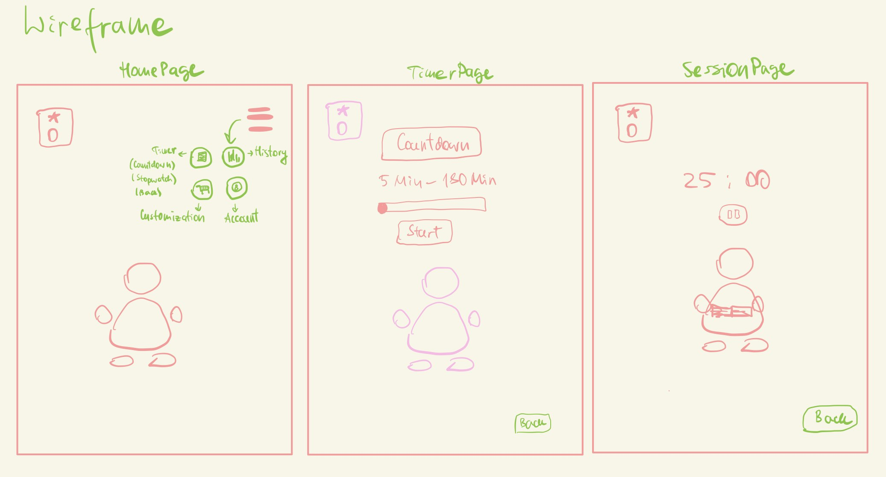
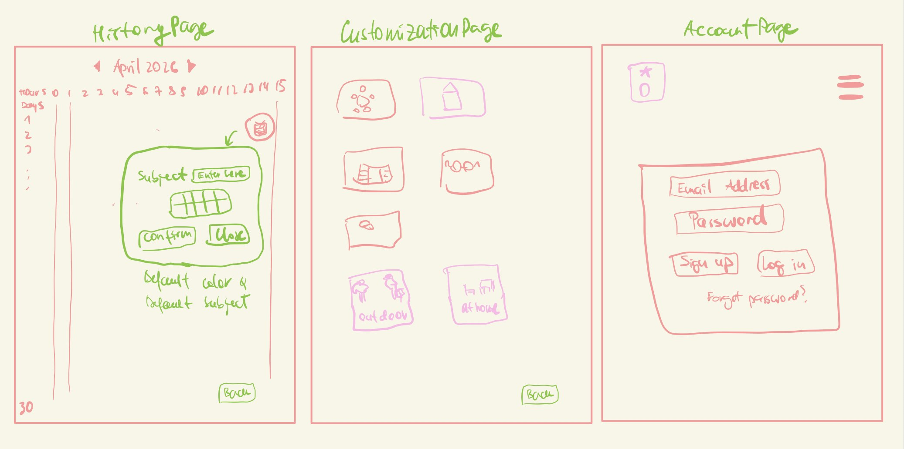

# TimerApp 23.04-28.04.2026
This plan shows the `intended approach` before starting coding.

## Overview

| `Date`       | `Todos`                      |
| ---------    | ----------------------       |
| 23.04        | Project started              |
| 24.04        | Layout implemented           |
| 25-27.04     | Logic implemented            |
| 28.04        | Project finalized            |
 

## Wireframes

## Procedure

### 23-24.04.2026
1. Create initial plan & Initialize repository
2. Build layout
3. Implement Homepage

### 25-28.04.2026
1. Implement TimerPage & SessionPage & AccountPage
2. Implement HistoryPage & CustomizationPage

## Issues / Tasks

### 23.04.2026
- Push plan

### 24.04.2026
- Layout + Routing + HomePage

### 25.04.2026
- Implement TimerPage & SessionPage

### 26.04.2026
- Implement HistoryPage

### 27.04.2026
- Implement CustomizationPage & AccountPage(just UI)

### 28.04.2026
- Bugfixes & Finalization

