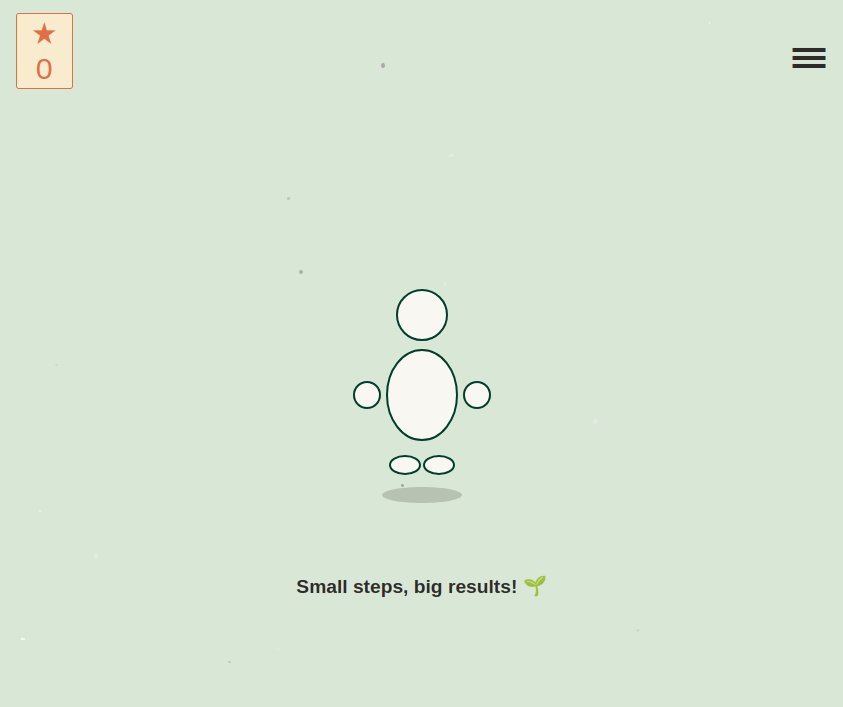
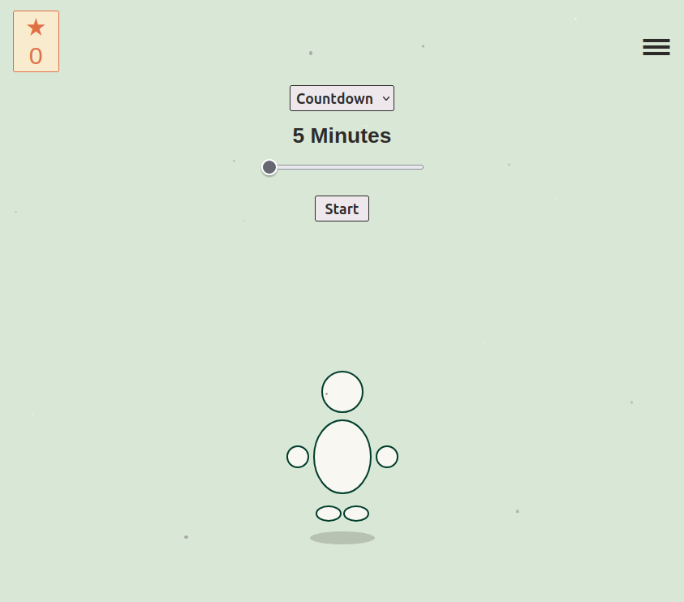
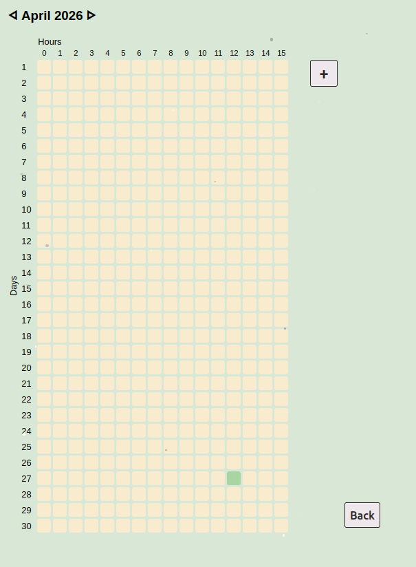
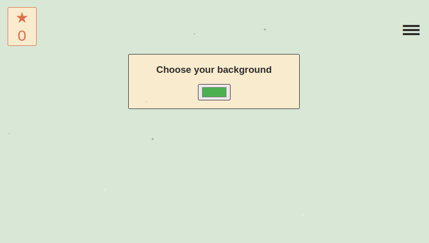
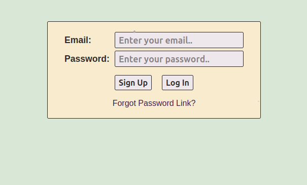

# Study Timer App

A study timer app built with React, inspired by the Studdy Bunny app.
Built in 5 days as a hands-on project to refresh and expand React knowledge.

## Screenshots

### Home

### Timer

### History

### Customize

### Account

## Tech Stack
- Vite + React
- React Router DOM
- localStorage

## What I practiced
- `useState` & `useEffect`
- React Router (useNavigate, useLocation)
- localStorage for data persistence
- CSS Flexbox & Grid
- SVG in React

## What I learned for the first time
- Building a heatmap from real data
- Passing state between pages

## Features
- ⏱️ Countdown timer (5–180 min)
- ⏱️ Stopwatch mode
- 📊 Study history heatmap
- 🎨 Background customization
- ✨ Sparkle effect

## Future Ideas
- Display stored session data in detail
- Earn stars after completed sessions
- Spend stars on customization options
- Avatar builder (glasses, clothes, accessories)
- Repeat session button
- Real authentication

## Getting Started
1. Clone the repository
2. Run `npm install`
3. Run `npm run dev`
4. Open [http://localhost:5173](http://localhost:5173)