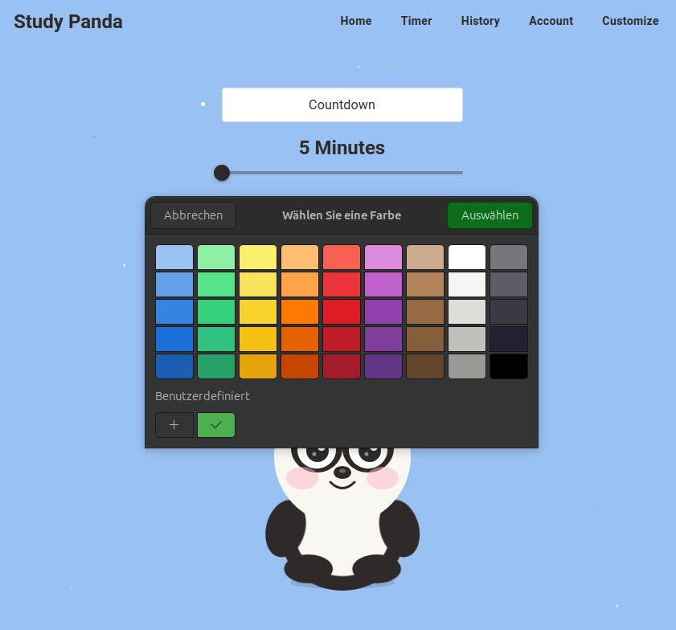

# Customize page -> Color picker stays visible after navigation

**Severity:** Medium  
**Priority:** High

**Description:**
When the user opens the color picker on the customize page and then navigates to another page (e.g., Timer), the color picker dialog remains visible on the screen, blocking the UI.

## Steps to Reproduce
1. Log in to the app
2. Navigate to the customize page
3. Click on the color picker to open the color palette
4. Without selection a color, click on "Timer" in the menu
5. Observe the timer page

## Expected Behavior
The color picker should close automatically when navigation away from the customize page.

## Actual Behavior
The color picker dialog stays open and is visible on top of the timer app.

## Environment
- Browser: Firefox (latest)
- OS: Ubuntu 24.04

## Screenshot

