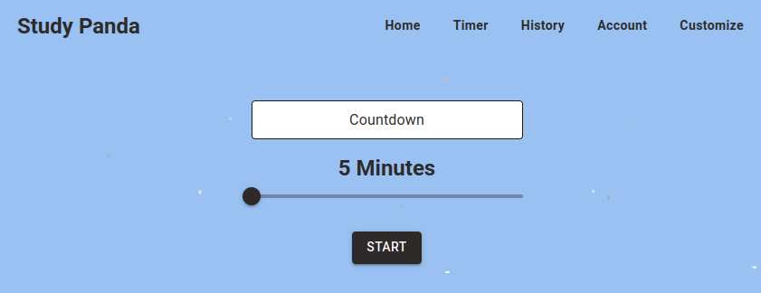

# Timer page -> Countdown text hovers with black border

**Severity:** Low
**Priority:** Low

**Description:**
When user hovers the "Countdown" text on the timer page, it gets a black border. This is confusing because it makes the text look like a clickable button.

## Steps to Reproduce
1. Log in to the app
2. Navigate to the timer page
3. Hover over the "Countdown" text
4. Observe the border

## Expected Behavior
The "Countdown" text should not have a hover effect.

## Actual Behavior
The "Countdown" text gets a black border on hover.

## Environment
- Browser: Firefox (latest)
- OS: Ubuntu 24.04

## Screenshot

