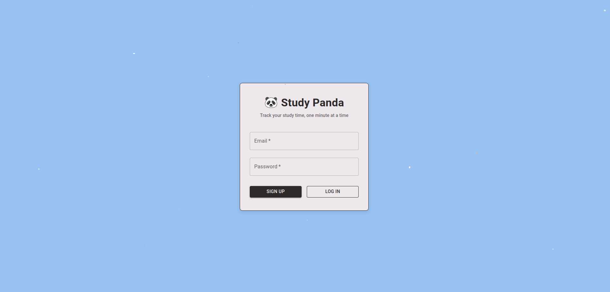
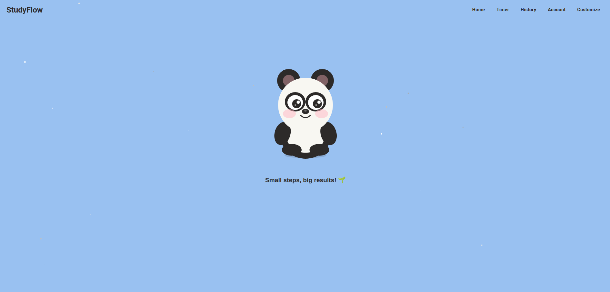
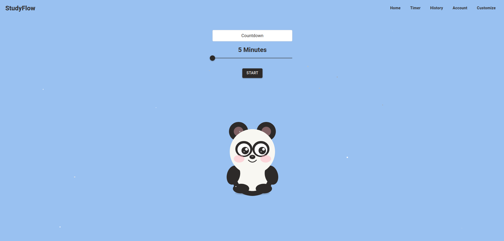
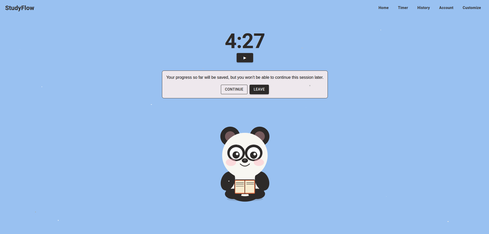
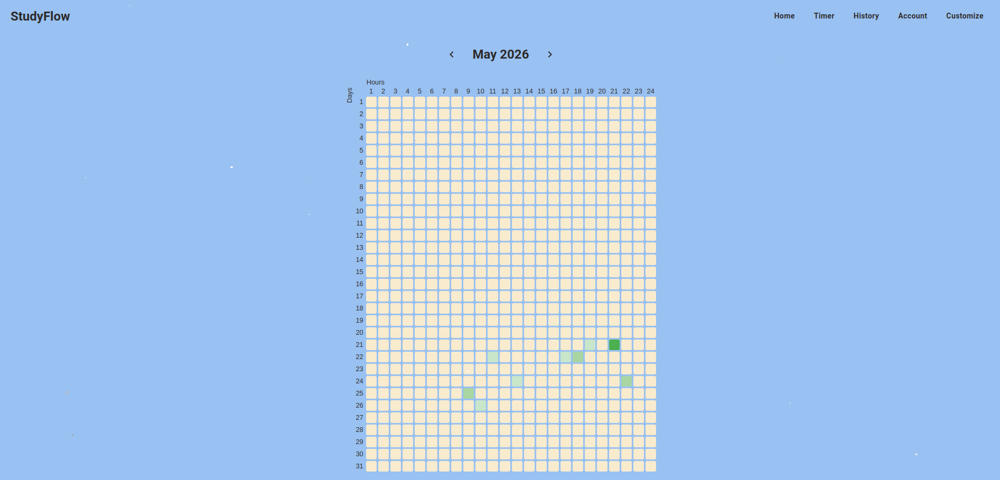
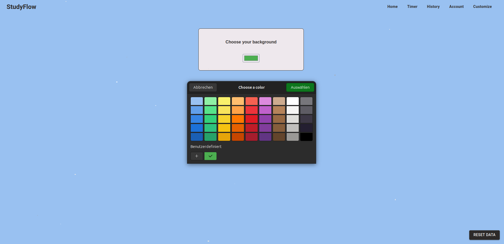
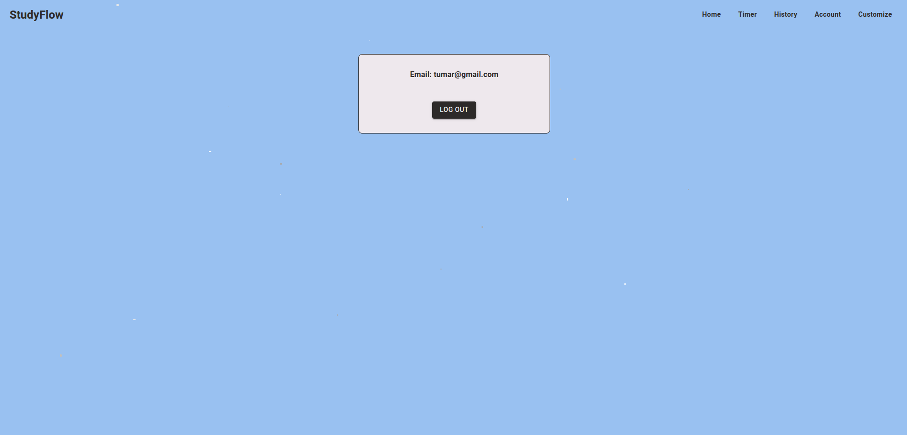

# 🐼 Study Panda

A study timer app built with React. Track your learning sessions, visualize progress with a heatmap, and stay motivated with a cute panda companion.

Built as a hands-on project to refresh and expand React & frontend skills.

For the full-stack Docker workflow, see the root [README](../README.md).

## Screenshots

### Login


### Home


### Timer


### Session



### History


### Customize


### Account


## Tech Stack
- Vite + React
- React Router DOM
- Material UI (MUI)
- localStorage for data persistence

## What I practiced
- `useState` & `useEffect` for timer logic
- React Router (`useNavigate`, `useLocation`, nested routes)
- localStorage for data persistence
- CSS Flexbox & Grid
- SVG animations in React

## What I learned for the first time
- Building a heatmap from real user data
- Passing complex state between pages
- Form validation with real-time error feedback
- Creating animated SVG characters (blinking, moving eyes)

## Features
- ⏱️ Countdown timer (5–180 min adjustable)
- 📊 Study history heatmap (hours 1-24, color-coded by intensity)
- 🎨 Customizable background color
- 🔐 Local authentication (signup / login with validation)
- ⚠️ Leave warning to prevent accidental session loss
- ✨ Sparkle effect and animated panda mascot

## Future Ideas
- Display detailed session data in table view
- Earn stars after completed sessions
- Spend stars on customization options (themes, accessories)
- Avatar builder (glasses, clothes, backgrounds)
- Repeat session button
- Real backend with FastAPI + SQLite
- User profiles and study streaks

## Getting Started

First, clone the repository: [TimerApp](https://github.com/fortunatus-png/TimerApp.git)

To run the frontend locally without Docker:

```bash
cd TimerApp
npm install
npm run dev
```

This starts the Vite dev server for the frontend only. For the backend and database, use the root README.

If you want the full application with Docker, start from the root [README](../README.md).

